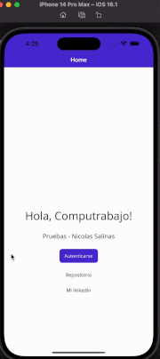
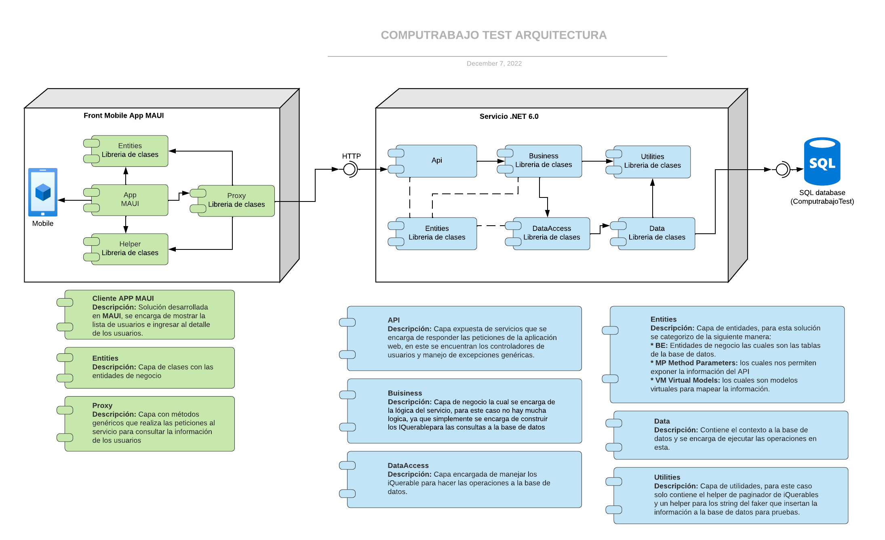
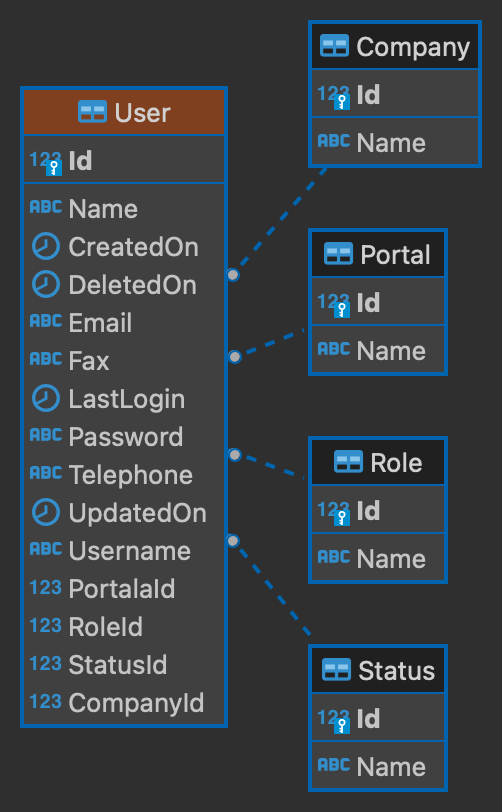
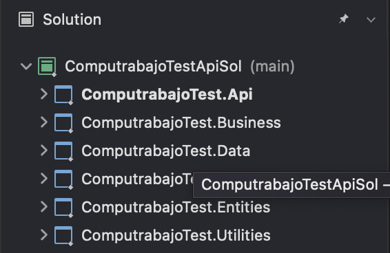
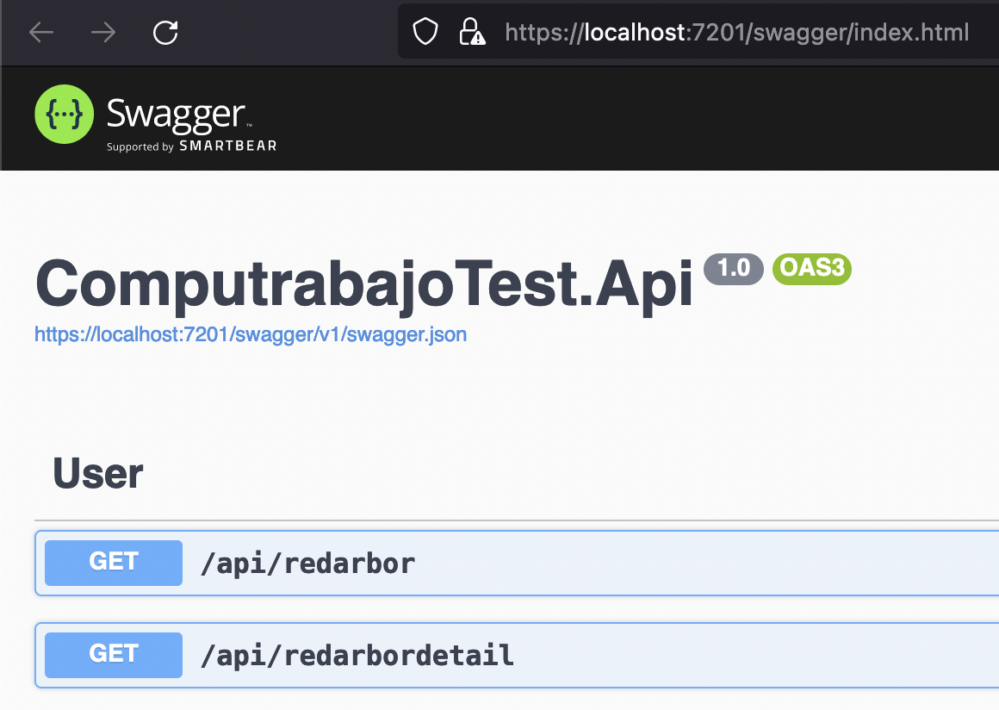
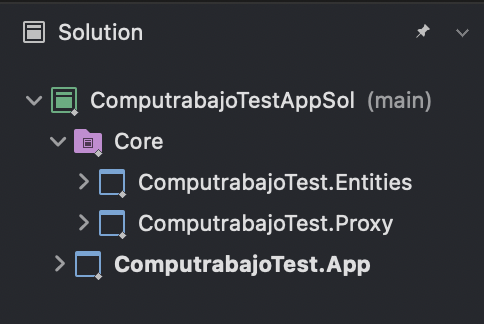

# Pruebas Computrabajo - Nicolas Salinas

A continuación se datalla la solución de las pruebas en estas encontraran los siguientes temas:

- **Evidencias** Aplicación mobile con la funcionalidad solicitada.
- **Arquitectura** Diagrama con los componentes que se desarrollaron para dar solución al requerimiento.
- **Diagramar de base de Datos** diagrama entidad relación.
- **Detalle de solución de API** desarrollada en .**NET 6.0.**
  - Estructura
  - Configuración
- **Detalle de la solución Mobile** desarrollada en **MAUI**
  - Estructura
  - Configuración

## EVIDENCIAS

Se adiciona evidencias de funcionamiento de la aplicación movil, apuntando al Servicio local el cual se conecta a una base de datos SQL Server, en este git se evidencia la funcionalidad de listar usuarios, ir al detalle y buscar en google el email del correo:

Video completo con el funcionamiento de la APP [Aqui!](https://drive.google.com/file/d/1sgzinw72k0npgyuUvxCEUAiPmyZ9GqSv/view?usp=sharing)

Preview App:




## ARQUITECTURA

Se desarrolla una arquitectura cliente servidor, donde el proyecto de la aplicación movil es independiente al proyecto API, a continuación se muestra un diagrama por componentes, posteriormente se explican estructuras de los proyectos de forma independiente.



## Diagramar de base de Datos
  
  Según el análisis de los datos enviados en la prueba construi el siguiente modelo de datos para soportar la información del sistema.



## NET CORE 6.0 API (namespace: ComputrabajoTest)

La solución se estructuró por capas para que sea altamente mantenible, desacoplada y cumpla con algunos patrones de diseño y desarrollo. Se crearon las siguientes capas:

### **Estructura de proyecto API**



- **Api**\
  Es la capa que se expone al cliente la cual contiene los métodos que consume el cliente para este caso la aplicación móvil. Para esta solución se implementó validación de excepciones de manera genérica con el fin manejar las excepciones de manera centralizada. También se usó **migrations** para manejar la base de datos por código y tener un versionamiento de la misma y contiene documentación por medio de **SWAGGER**. A continuación se muestran los métodos expuestos:



- **Business**\
  Es la capa encargada de la lógica de negocio, para el caso de este proyecto no contiene validaciones o procesos adicionales a la de manejo de datos.

- **Entities**\
  Es la capa que contiene las entidades necesarias para mapear la información y retornar los datos. Se categorizaron las entidades de negocio de la siguiente manera:

  - BE (Business Entities): Entidades de negocio las cuales se encargan de mapear las tablas de la base de datos.
  - MP (Method Parameters): Son los parámetros de entrada y salida de los métodos del API.
  - VM (Virtual Model): Son las modelos virtuales para mapear información interna que se quiere devolver en el servicio.

- **DataAccess**\
  Es la capa que se encarga de manejar los iQuerables de las entidades de negocio para realizar las operaciones en la base de datos.

- **Data**\
  Es la capa que contiene el contexto y se encarga de ejecutar todos los procesos directamente en la base de datos.

- **Utilities**\
  Esta se usa para generar funciones genéricas que se necesiten a lo largo de la solución, para este caso únicamente se tiene una función de paginación de iQuerables y un, truncate para los string que se insertan en la base de datos como datos fake para pruebas.

### **CONFIGURACIÓN**

Se adiciona el ConnectionString para que sea fácil de cambiar en cualquiera ambiente donde se quiere desplegar o usar. 

```json
{
  "ConnectionStrings": {
    "ComputrabajoTestContext": "Data Source=localhost; Initial Catalog=ComputrabajoTest; User Id=sa; Password=your_password123;TrustServerCertificate=True"
  }
}

```

## APP MAUI (namespace: ComputrabajoTest)

### **Estructura de proyecto Web**



La solución se estructuró por capas para que fuera modular y tenga alta mantenibilidad, las cuales son las siguientes:

- **App**\
  Es el proyecto en **MAUI** el cual se encarga de mostrar al cliente la interfaz gráfica con la funcionalidad de interactuar con la información, como se mostró anteriormente en el ítem de la evicencia de funcionamiento.

- **Entities**\
  Proyecto que contiene las entidades de negocio necesarias para mapear la información y poderla manipular.

- **Proxy**\
  Proyecto que se encarga de realizar la comunicación con el servicio como se mostró en el diagrama de componentes, este contiene los métodos genéricos para realizar peticiones HTTP.
  
### **CONFIGURACIÓN**

Se creo un archivo de constantes el cual tontiene la url parcial del servicio al cual se va a consumir.

```c#
public static class Settings
    {
        public static string DOMAIN = "http://localhost:5105/api";
    }
```
